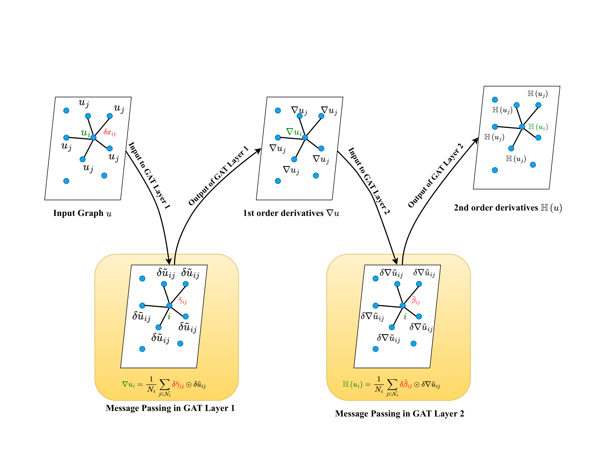
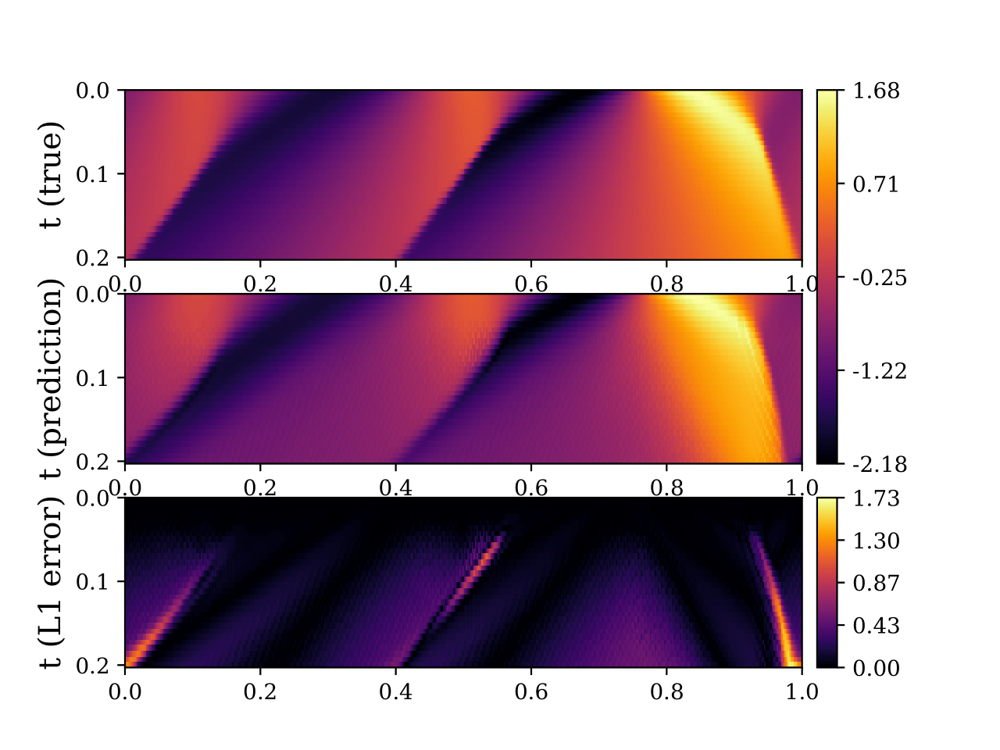

# GrADE
### This repository contains the official implemention of the paper  GrADE: A graph based data-driven solver for time-dependent nonlinear partial differential equations

## 1D Viscous Burgers' Equation



## Quick Start

### set up a conda environment

```
conda create -n grade_env python=3.8
conda activate grade_env
sh install.sh
```

### generate data
```
cd data/pde_1d
python3 fenics_burger1D.py
```

### Training for Burgers 1d Equation

```
cd src
python Loop.py --prjct_dir /<path_to_this_repository_on_your_system>/GrADE
```

## Citation
Find this useful or like this work? Cite us with:
```latex
@article{}
}
```
